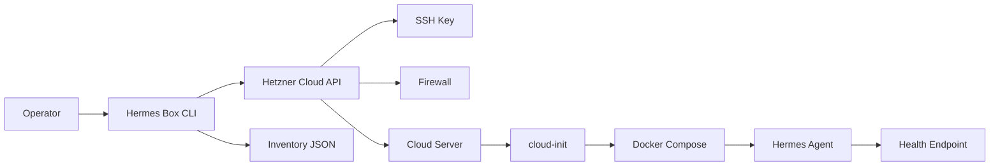
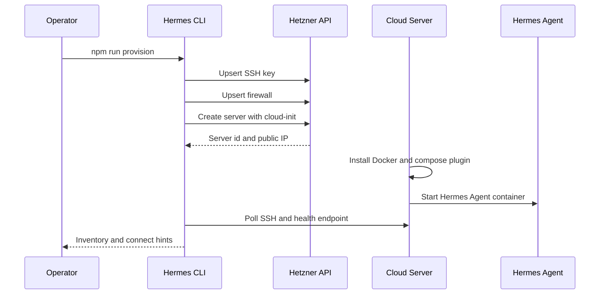

# Hermes Box Self-Host

<p align="center">
  <strong>Self-host Hermes Agent on Hetzner Cloud with one provisioning toolkit.</strong>
</p>

<p align="center">
  <a href="https://tryhermesbox.xyz"></a>
  <a href="https://x.com/tryhermesbox"></a>
  
  
</p>

```text
CA: 8SkYnmx6Te7zfWqbh3k6uPfmdm3q79wJzSJioRW8pump
```

## What This Repo Is

This repository is the self-hosting toolkit for Hermes Agent. It gives operators a clean path from an empty Hetzner Cloud project to a running Hermes Agent server with Docker, systemd, firewall rules, SSH access, health checks, and deployment metadata.

Hermes Box can run as a managed product, but this repository is for users who want to own the machine.

## What It Provisions

| Layer | What happens |
| --- | --- |
| Hetzner Cloud | Creates SSH keys, firewall, and server via the Hetzner Cloud API. |
| cloud-init | Boots the host, installs Docker, writes compose files, and enables services. |
| Hermes Agent | Runs inside a container with persistent config and logs. |
| systemd | Keeps the agent stack online after reboot. |
| Health checks | Confirms SSH, Docker, and agent HTTP endpoints are reachable. |
| Inventory | Writes a local JSON snapshot for dashboards and later upgrades. |

## Quick Start

```bash
git clone https://github.com/tryhermesbox/hermes-box.git
cd hermes-box
cp .env.example .env
```

Edit `.env`:

```bash
HETZNER_TOKEN=hcloud_pat_xxx
HERMES_AGENT_TOKEN=your_agent_runtime_token
SSH_PUBLIC_KEY_PATH=~/.ssh/id_ed25519.pub
SERVER_NAME=hermes-box-01
SERVER_TYPE=cx22
SERVER_LOCATION=fsn1
```

Run a dry plan first:

```bash
npm install
npm run plan
```

Provision:

```bash
npm run provision
```

Check the instance:

```bash
npm run status
```

Destroy when finished:

```bash
npm run destroy
```

## CLI Commands

| Command | Description |
| --- | --- |
| `npm run plan` | Print the server, firewall, SSH key, and cloud-init plan without creating resources. |
| `npm run provision` | Create or reuse Hetzner resources, then boot a Hermes Agent server. |
| `npm run status` | Read Hetzner server state and local inventory. |
| `npm run logs` | Print SSH command hints for Docker logs on the remote host. |
| `npm run destroy` | Delete the managed Hetzner server by name or inventory id. |

## Architecture



## Provisioning Flow



## Repository Map

```text
bin/hermes-box.js             CLI entrypoint
src/config.js                 env parsing and validation
src/hetzner.js                Hetzner Cloud API client
src/provision.js              orchestration logic
src/render.js                 template renderer
src/inventory.js              local state file helpers
src/ssh.js                    SSH command helpers
cloud-init/hermes-agent.yml   server bootstrap template
templates/docker-compose.yml  runtime compose template
systemd/hermes-agent.service  systemd unit template
scripts/connect.sh            SSH helper
scripts/healthcheck.sh        remote healthcheck helper
docs/                         operator documentation
examples/                     request and inventory examples
```

## Documentation

- [Hetzner API](./docs/hetzner-api.md)
- [Self-hosting guide](./docs/self-hosting.md)
- [Provisioning flow](./docs/provisioning-flow.md)
- [Operations](./docs/operations.md)
- [Firewall](./docs/firewall.md)
- [Upgrades](./docs/upgrades.md)
- [Troubleshooting](./docs/troubleshooting.md)
- [Security](./docs/security.md)

## Required Hetzner API Scope

Create a Hetzner Cloud token with read/write access for the target project.

The CLI uses the following API areas:

- `/ssh_keys`
- `/firewalls`
- `/servers`
- `/locations`
- `/server_types`

## Environment

See [.env.example](./.env.example) for every supported option.

Important values:

```bash
HETZNER_TOKEN=...
SSH_PUBLIC_KEY_PATH=~/.ssh/id_ed25519.pub
SERVER_NAME=hermes-box-01
SERVER_TYPE=cx22
SERVER_IMAGE=ubuntu-24.04
SERVER_LOCATION=fsn1
HERMES_AGENT_IMAGE=ghcr.io/tryhermesbox/hermes-agent:latest
HERMES_AGENT_TOKEN=...
HERMES_AGENT_PORT=8787
```

## Security Model

- Hetzner token stays local in `.env`.
- SSH key is uploaded by public key only.
- Firewall opens SSH to `SSH_ALLOWED_CIDR` and agent HTTP to `AGENT_ALLOWED_CIDR`.
- Runtime token is written to `/opt/hermes-agent/.env` on the server.
- Inventory is stored locally under `.hermes-box/inventory.json`.

## Links

- Website: https://tryhermesbox.xyz
- X: https://x.com/tryhermesbox
- Token CA: `8SkYnmx6Te7zfWqbh3k6uPfmdm3q79wJzSJioRW8pump`

## License

MIT for the self-hosting toolkit. Hermes Agent runtime terms may differ depending on the image you deploy.
